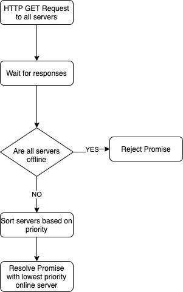

## Test Requirements
Create a function/method that can assess a list of webservers and then returns 
a server with the lowest priority. Also create a unit test that can check if 
the function/method works as expected.



#### Requirements

- A `findServer()` function which returns a Promise that either:
  - Resolves and return an online server with the lowest priority.
  - Reject with an error if no servers are online.
- The HTTP server requests should be used to check if the server is online or offline depending on the following requirements:
  - All server GET requests should be run in parallel.
  - The GET request should timeout after 5 seconds.
  - When the GET request responds with a status code of 200-299, it is considered online.
- A unit test that checks all the underlying components/requirements.
  - The server requests should be mocked.

#### JSON Array to use

```json
[
  {
    "url": "https://does-not-work.perfume.new",
    "priority": 1
  },
  {
    "url": "https://gitlab.com",
    "priority": 4
  },
  {
    "url": "http://app.scnt.me",
    "priority": 3
  },
  {
    "url": "https://offline.scentronix.com",
    "priority": 2
  }
]
```

#### What are we expecting

- Neatly written and formatted code for production level environment.
- Demonstration of knowledge on NodeJS.
- Demonstration of knowledge on Typescript.
- Demonstration of knowledge on Promises/aync/await.
- Demonstration of knowledge on Unit Testing including experience with mocking target server(s) (We DO NOT expect you to have high test coverage).


## Installation

```bash
$ npm install
```

## Running the app

```bash
# development
$ npm run start

# watch mode
$ npm run start:dev

# production mode
$ npm run start:prod
```

## Test

```bash
# unit tests
$ npm run test

# e2e tests
$ npm run test:e2e

# test coverage
$ npm run test:cov
```
